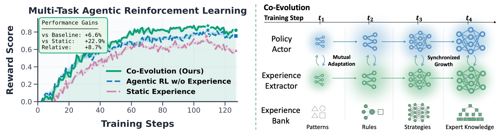

# Complementary Reinforcement Learning

<div align="center">

[](LICENSE)

**Co-evolving policy actors and experience extractors for efficient experience-driven agent RL**

</div>

---

## Overview

<div align="center">
  
</div>

**Complementary RL** enables agents to effectively learn from experience through the seamless co-evolution of an *experience extractor* and a *policy actor* within the RL optimization loop.

---

## Table of Contents

- [Installation](#installation)
- [Architecture](#architecture)
  - [Memory Module](#memory-module)
  - [Environment Manager Integration](#environment-manager-integration)
  - [Training Pipeline](#training-pipeline)
- [Quick Start](#quick-start)
- [Citation](#citation)
- [Acknowledgements](#acknowledgements)

---

## Installation

### Prerequisites

Complementary RL is built on top of the [ROLL framework](https://github.com/alibaba/ROLL). Please ensure the following system requirements are met before installing:

```
CUDA Version >= 12.4
cuDNN Version >= 9.1.0
PyTorch >= 2.6.0
vLLM >= 0.8.4
```

For full ROLL installation documentation, see: [https://alibaba.github.io/ROLL/docs/Getting%20Started/Installation/](https://alibaba.github.io/ROLL/docs/Getting%20Started/Installation/)

### Step 1 — Clone the Repository

```bash
git clone https://github.com/<your-org>/ComplementaryRL.git
cd ComplementaryRL
```

### Step 2 — Install Dependencies

We provide a pinned requirements file for PyTorch 2.6 + vLLM:

```bash
# Install core dependencies
pip install -r requirements_common.txt

# Install PyTorch 2.6 + vLLM stack
pip install -r requirements_torch260_vllm.txt
```

### Step 3 — Install as a Package (Development Mode)

```bash
pip install -e .
```

---

## Architecture

Complementary RL is implemented within the ROLL agentic pipeline framework. The core contribution lives in two places:

```
roll/pipeline/agentic/
├── memory/                        # Centralized experience manager
│   ├── memory_config.py           # All configuration dataclasses
│   ├── async_memory_manager.py    # Production AsyncMemoryManager (Ray-based)
│   ├── memory_manager.py          # Lightweight synchronous MemoryManager
│   ├── memory_factory.py          # Factory for building memory managers
│   └── merge_utils.py             # Periodic memory merge logic
├── env_manager/
│   ├── memory_hooks.py            # Episode/turn lifecycle hooks
│   ├── memory_builders.py         # Query and memory value construction
│   └── memory_integration_mixin.py # Full integration mixin for env managers
└── multi_agentic_pipeline.py      # FullyAsyncMemoryActorPipeline
```

### Memory Module

The memory module implements the centralized **Experience Manager** from the paper. It is composed of the following sub-components, all configurable via `MemoryConfig`:

#### `MemoryConfig` — Configuration

Located in `roll/pipeline/agentic/memory/memory_config.py`.

| Field | Type | Description |
|---|---|---|
| `memory_type` | `MemoryType` | `case_memory`, `case_embedding_memory`, or `trajectory_memory` |
| `memory_structure` | `MemoryStructure` | `tabuler` (single-task) or `multi_task_tabuler` |
| `memory_integration_strategy` | `MemoryIntegrationStrategy` | `turn_based`, `trajectory_based`, or `both` |
| `searcher` | `SearcherConfig` | Search strategy, fetch count, diversity re-ranking |
| `updater` | `UpdaterConfig` | Eviction strategy (`lru`, `fifo`, `random`) and memory size cap |
| `embedding_model` | `EmbeddingModelConfig` | Dense embedding model for semantic retrieval |
| `memory_model` | `MemoryModelConfig` | Experience extractor πϕ configuration |
| `memory_actor_train` | `MemoryModelWorkerConfigBase` | Training config for πϕ |
| `memory_actor_enable_training` | `bool` | Whether to co-train the experience extractor |

**Integration Strategies:**

| Strategy | Search Timing | Update Timing |
|---|---|---|
| `turn_based` | Before every decision step | After every environment step |
| `trajectory_based` | Once at episode start | Once at episode end |
| `both` | Both of the above | Both of the above |

#### `SearcherConfig` — Retrieval with Diversity Re-ranking

The searcher supports multiple retrieval backends (`simple_similarity`, `embedding_similarity`, `faiss`) and implements **Retrieval Diversification** (Appendix B of the paper) to avoid repeatedly surfacing the same experience:

```python
# Diversity re-ranking score: s(m) = srank(m) - λ·log(1+c(m)) - 1[recent(m)]
searcher:
  memory_search_strategy: embedding_similarity
  memory_fetch_num: 1
  diversity_enable: true
  diversity_lambda: 0.4              # Penalizes frequently retrieved memories
  diversity_recent_seconds: 300      # Recency window (seconds)
  diversity_dropout_p: 0.5           # Probability to demote top-1 if recently retrieved
  diversity_candidate_multiplier: 16 # Oversample candidates before re-ranking
```

#### `MemoryModelConfig` — Experience Extractor

The experience extractor processes completed trajectories and issues structured operations to maintain the experience bank:

- **`Add`** — synthesize a new experience entry from the trajectory
- **`Update`** — refine the previously retrieved entry based on new evidence
- **`Return`** — no action when the episode yields no extractable insight

It also supports **Periodic Merge** to consolidate redundant entries that accumulate from parallel group-based RL training:

```python
memory_model:
  enable_merging: true
  merging_interval: 5            # Trigger merge every 5 actor update steps
  max_merging_item_per_call: 5   # Chunk size for the sliding merge window
  memory_model_type: local_model
  memory_model_with_functional_operations: true
  memory_model_max_functional_operations: 3
```

#### `AsyncMemoryManager` — Experience Manager

`roll/pipeline/agentic/memory/async_memory_manager.py` is the Ray-based implementation. It provides:

- **Query batching and caching**: accumulates concurrent retrieval queries into micro-batches; cache hits on the embedding layer avoid redundant GPU inference
- **Parallel search workers**: distributes similarity search across W workers under a reader lock, enabling concurrent reads from hundreds of environments
- **Writer-lock updates**: applies `add`/`update`/`merge` operations atomically to prevent state conflicts
- **Distillation queue**: a producer-consumer queue decouples the actor rollout loop from experience distillation, ensuring zero blocking latency to actor training

---

### Environment Manager Integration

Any environment manager can integrate the memory system by inheriting from `MemoryIntegrationMixin`:

```python
from roll.pipeline.agentic.env_manager.memory_integration_mixin import MemoryIntegrationMixin

class MyEnvManager(MemoryIntegrationMixin, BaseEnvManager):
    ...
```

`MemoryIntegrationMixin` composes two mixins:

#### `MemoryHooksMixin` (`memory_hooks.py`)

Defines the lifecycle of memory operations via four hooks that env managers call at the appropriate points:

```python
# Call at the start of an episode (step == 0)
self.hook_on_episode_start(rollout_cache, log_stats)

# Call before make_decision() each turn
self.hook_on_turn_start(rollout_cache, log_stats)

# Call after env.step() each turn
self.hook_on_turn_end(rollout_cache, log_stats)

# Call when the episode terminates
self.hook_on_episode_end(rollout_cache, log_stats)
```

Each hook is a no-op unless the corresponding strategy is enabled in `MemoryConfig`:

| Hook | `turn_based` | `trajectory_based` | `both` |
|---|:---:|:---:|:---:|
| `hook_on_episode_start` (search) | | ✓ | ✓ |
| `hook_on_turn_start` (search) | ✓ | | ✓ |
| `hook_on_turn_end` (update) | ✓ | | ✓ |
| `hook_on_episode_end` (update) | | ✓ | ✓ |

#### `MemoryBuildersMixin` (`memory_builders.py`)

Provides overridable methods for constructing memory queries and values. Override these in your environment manager to customize how experience is encoded:

```python
def build_memory_query(self, last_history: Dict, task_goal: Optional[str] = None) -> str:
    """Build a retrieval query from the current observation and task goal."""
    ...

def build_turn_memory_value(self, action, action_is_valid, action_is_effective, action_result) -> str:
    """Build a turn-level (episodic) memory entry."""
    ...

def build_trajectory_memory_value(self, rollout_cache: RolloutCache, task_goal: str) -> str:
    """Build a full trajectory summary for procedural memory."""
    ...
```

#### `MemoryIntegrationMixin` — Full Integration

Combines both mixins and adds:

- **Actor-Critic** (`actor_critic()`): before each episode, the policy actor πθ reflects on the retrieved experience and issues one of `accept` / `refine` / `reject`, gating potentially harmful or stale experience (see Appendix B.1 of the paper).
- **Memory metadata** (`add_memory_metadata_to_rollout()`): attaches `triggered_interactions` and `evolve_with_memory` flags to rollout batches so the pipeline can route experience-guided and experience-free trajectories to separate advantage groups.
- **Prompt injection**: supports `system`, `user`, or `none` injection modes for trajectory memory via `get_trajectory_memory_injection_mode()`.

---

### Training Pipeline

`roll/pipeline/agentic/multi_agentic_pipeline.py` implements `FullyAsyncMemoryActorPipeline`, which orchestrates the full Complementary RL training loop.

**Two-track asynchronous design:**

```
Primary Training Loop                    Background Track
─────────────────────────────────        ────────────────────────────────────
Actor (πθ) rollout collection       ←──  Experience retrieved from Memory Bank
        │                                        │
        ↓                                        ↑
Actor (πθ) policy update (GRPO)          Experience extractor (πϕ) update (CISPO)
        │                                        │
        └──► Submit trajectories ──────────────► Distillation Queue
```

**Key design choices reflected in the pipeline:**

- **Subgroup advantage estimation**: each rollout batch is split into an *experience-guided* group and an *experience-free* group. Advantages are computed *within each subgroup*, preventing cross-group reward-scale bias (Equation 5 in the paper). Controlled via `grouped_actor_pg` config.

- **Experience extractor training buffer** (`MemoryTrainingBuffer`): accumulates `(experience, reward)` pairs across multiple rollout collection steps. The extractor πϕ is only updated once the buffer reaches `memory_training_batch_size`, decoupling the two optimization schedules.

- **Training-Count-Aware Advantage Reweighting**: a cooldown mechanism (`memory_repeat_cooldown_steps`) and count-based decay discount overused experience entries in the extractor's training buffer to prevent overfitting.

**Launch the pipeline:**

```bash
python examples/start_memoryactor_async_pipeline.py \
    --config_path examples/singletask-agentic \
    --config_name single_task_complementaryrl
```

---

## Quick Start

We provide example configurations under `examples/singletask-agentic/` for the MiniHack Room experiments.

### Baseline (actor-only RL, no experience)

```bash
python examples/start_agentic_pipeline.py \
    --config_path examples/singletask-agentic \
    --config_name single_task_baseline
```

### Complementary RL (actor + experience extractor co-training)

```bash
python examples/start_memoryactor_async_pipeline.py \
    --config_path examples/singletask-agentic \
    --config_name single_task_complementaryrl
```
---

---

## Acknowledgements

Complementary RL is built on top of the **[ROLL](https://github.com/alibaba/ROLL)** (Reinforcement Learning for LLMs) framework developed by Alibaba. We thank the ROLL team for providing a robust and extensible infrastructure for agentic RL research.

The training infrastructure leverages:
- [Ray](https://www.ray.io/) for distributed execution
- [vLLM](https://github.com/vllm-project/vllm) for high-throughput LLM inference
- [Megatron-LM](https://github.com/NVIDIA/Megatron-LM) (via ROLL's MCore adapter) for model training
- [FAISS](https://github.com/facebookresearch/faiss) for scalable similarity search
